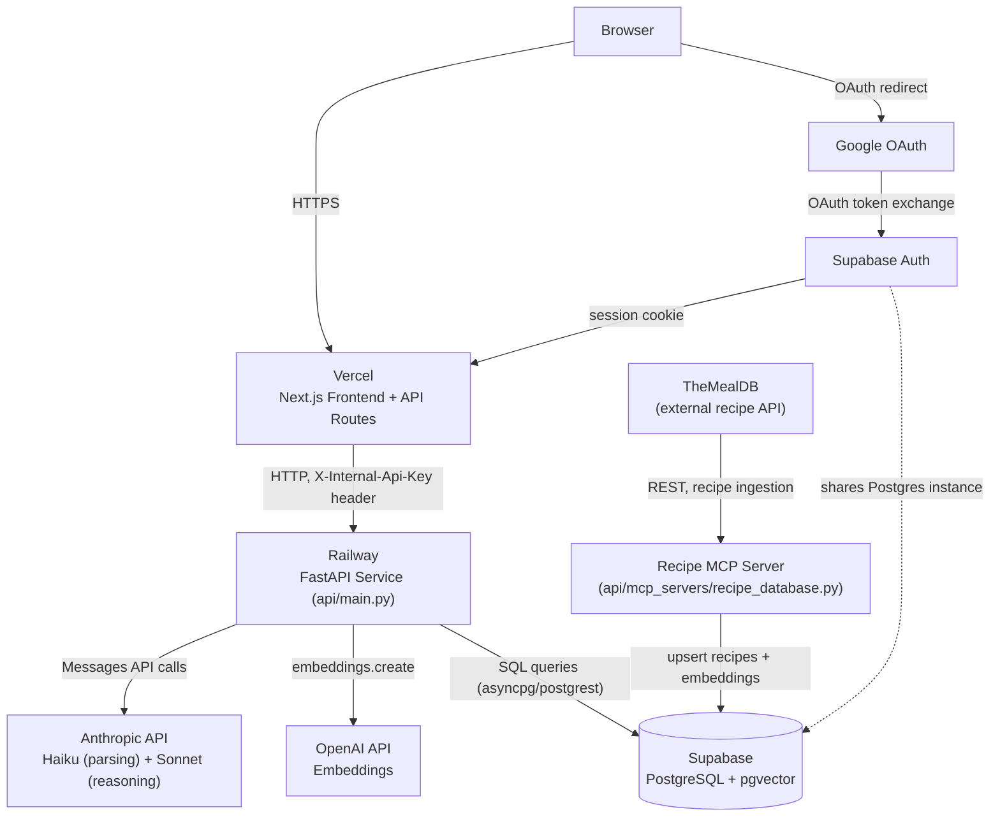
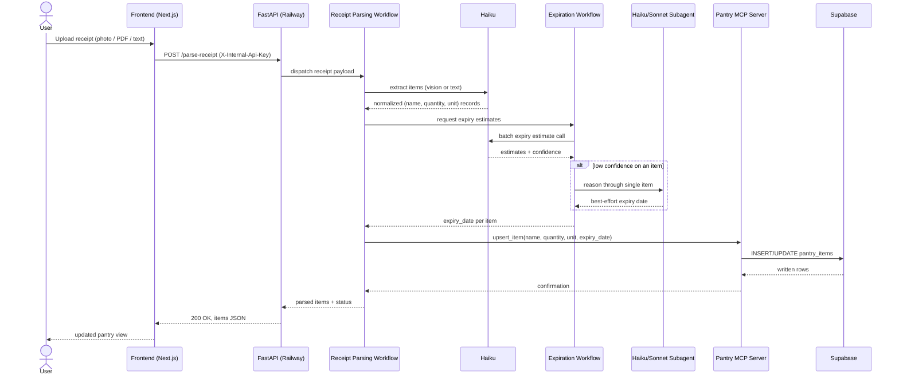

# MealMind

## Overview

MealMind turns a photo of a grocery receipt into a running pantry inventory, then uses that inventory to recommend meals that prioritize ingredients close to expiring. It combines a deterministic parsing/tracking pipeline with LLM agents for the steps that require judgment — reading messy receipt text, estimating shelf life, and ranking recipes against what's actually in the kitchen. The end result is a shopping list generated from pantry state, cooking history, and preferences — replenishing what's running low, complementing what's already on hand, or re-enabling a dish the user has cooked before — closing the loop from "what did I buy" to "what should I cook" to "what do I need next."

### System architecture

Some Next.js API routes are plain CRUD against Supabase directly (auth-scoped via row-level security) and don't traverse the FastAPI hop shown above — see `frontend/lib/python-api.ts` for which routes call out to Railway versus talk to Supabase directly.

### Receipt-to-pantry data flow

## Architecture

### Workflows vs. agents

MealMind draws a hard line between **workflows** (`api/workflows/`) and **agents** (`api/agents/`), and that line is the main architectural decision in the codebase:

- A **workflow** is deterministic control flow. The sequence of steps is fixed and known in advance regardless of what any individual step returns — step 2 always follows step 1. Workflows own orchestration, retries, and persistence, and they call into agents for the specific sub-steps that need model reasoning.
- An **agent** is used where the next action, or the interpretation of the input, can't be hard-coded — where the model has to make a judgment call under ambiguity.

`api/agents/orchestrator.py` sits above both: it's a thin dispatch layer that routes an incoming event (receipt upload, scheduled expiration check, user request) to the right workflow or agent. It does no domain reasoning itself, which keeps the routing logic testable independent of any model behavior.

Applying that principle to each piece of the pipeline:

| Component | Type | Why |
|---|---|---|
| `api/workflows/receipt_parsing.py` | Workflow | The steps (OCR → extract → validate → persist) never branch based on content — always run in this order, so there's no reason to spend a model call deciding "what's next." |
| `api/agents/parser.py` | Agent | Receipt OCR output is unstructured and inconsistent — abbreviated item names, merged lines, store-specific formatting. Turning that into normalized `(name, quantity, unit, category)` records requires interpretation, not pattern matching. |
| `api/workflows/expiration_workflow.py` | Workflow | Runs on a fixed schedule, fetches pantry state, calls the expiration agent, and branches to a fallback on failure — the branching condition (did the model call succeed?) is deterministic, not a judgment call. |
| `api/agents/expiration.py` | Agent (with Sonnet subagent fallback) | Estimating shelf life from a bare item name ("spinach," no purchase context) benefits from a model that knows typical spoilage patterns by category and storage condition. See fallback design below. |
| `api/agents/meal_recommender.py` | Agent | Ranking retrieved recipes against pantry contents, expiring items, and user preferences is an open-ended judgment call — there's no fixed rule for "best meal to cook tonight." |
| `api/agents/shopping_list.py` | Agent | Deciding what to buy next weighs several open-ended signals at once — what's running low, what would round out pantry items already on hand into a full dish, what would re-enable a recipe cooked before — with no fixed rule for combining them, so the whole suggestion step is delegated to a model rather than just ingredient-name reconciliation. |

### Model selection

Model choice follows task shape — volume and latency sensitivity on one axis, reasoning depth on the other — rather than defaulting to the largest available model everywhere:

| Step | Model tier | Why |
|---|---|---|
| Receipt parsing | Haiku | Runs once per receipt upload while the user is waiting; the extraction task is narrow and well-specified, so a fast, cheap model hits the accuracy bar without the latency cost of a larger one. |
| Expiration estimation (primary) | Sonnet | Runs asynchronously in the background workflow, so latency matters less than judgment quality — estimating shelf life from limited context benefits from stronger reasoning. |
| Expiration estimation (fallback) | Sonnet | Runs only for the items Haiku flags low-confidence on, so the extra reasoning cost is spent selectively rather than on every item. See below. |
| Meal recommendation | Sonnet (Opus as a future premium-tier option) | The highest-stakes reasoning step in the pipeline — synthesizes multiple RAG-retrieved candidates, pantry constraints, and (Phase 2) learned preferences into a ranked, explained recommendation. Runs once per session, so cost/latency headroom is available to spend on quality. |
| Shopping list generation | Sonnet | Weighing pantry state, recent cook history, and preferences into ranked, justified suggestions is the same shape of open-ended reasoning as meal recommendation — runs once per (re)generation, not at high volume, so the latency/cost headroom is available. |

### Why MCP servers instead of direct API calls

`api/mcp_servers/pantry_inventory.py` and `api/mcp_servers/recipe_database.py` wrap the pantry store and recipe source behind MCP tool contracts rather than having agents call Supabase or TheMealDB directly:

- **Decoupling.** Agents call `list_items`, `upsert_item`, `query_recipes_by_ingredients`, etc. — identical tool schemas regardless of what's behind them. Swapping the recipe source or moving off Supabase later means changing the MCP server implementation, not every agent that reads pantry or recipe data.
- **Credential isolation.** Agent processes hold no direct database credentials — only a tool contract. Database access is scoped to two small, independently auditable server processes instead of the entire agent codebase.
- **Reuse.** The same two MCP servers are usable by any future client — a Phase 2 voice-input agent, an admin dashboard — without duplicating query logic.
- **Native fit with the Anthropic SDK.** Tool-use in the Anthropic SDK is schema-first; MCP servers are a direct, standard way to hand the model a typed tool it can call, without hand-rolling a tool-dispatch layer per agent.

### RAG for recipe retrieval (pgvector)

Recipe retrieval doesn't hand the meal recommender agent the entire recipe corpus — it narrows the field with a vector search first, then lets the model reason over a short list:

1. Recipes ingested from TheMealDB (via `api/mcp_servers/recipe_database.py`) are embedded — title, ingredient list, and instructions — and the resulting vector is stored on the `recipes` row using Supabase's `pgvector` extension.
2. When a recommendation is requested, the pantry items nearest expiration are turned into a query embedding.
3. `pgvector` runs an approximate nearest-neighbor search (cosine similarity, `ivfflat`/`hnsw` index) to pull the top-K semantically closest recipes — e.g. recipes whose ingredient profile overlaps most with what's on hand.
4. Those K candidates, not the full corpus, are passed into `api/agents/meal_recommender.py`'s prompt for final ranking and justification.

This keeps the reasoning step's token cost and latency bounded regardless of how large the recipe corpus grows, and it lets retrieval improve independently of the ranking model. `pgvector` specifically (rather than a standalone vector database) was chosen because embeddings live in the same Postgres instance as the relational recipe metadata — a single SQL query can combine metadata filters (dietary tags, prep time) with vector similarity (`WHERE dietary_tags @> ARRAY['vegetarian'] ORDER BY embedding <=> query_embedding LIMIT 10`), avoiding a second system to keep in sync.

## Tech Stack

| Technology | Role | Why this choice |
|---|---|---|
| **Next.js** | Frontend (App Router) | Server components fit the read-heavy pantry/recipe views; API routes and server actions give a straightforward home for the endpoints that trigger workflows without a separate backend service. |
| **Supabase (Postgres + pgvector)** | Primary datastore + vector search | One database for both relational data (pantry, receipts, shopping lists) and recipe embeddings — no separate vector store to provision or keep in sync, and row-level security maps cleanly onto per-user pantry data. |
| **Anthropic SDK** | Agent runtime | Native MCP tool-use support and per-call model selection are what let the agent layer mix Haiku and Sonnet by task (see Model Selection above) without a custom abstraction on top. |
| **TheMealDB MCP server** | Recipe source | A free, structured recipe API exposed as an MCP tool rather than called directly, for the decoupling reasons described above — the recipe corpus can later be swapped or supplemented without touching agent code. |
| **Vercel** | Hosting | First-party Next.js deployment (App Router, server actions, edge/serverless functions) with minimal configuration; pairs directly with Supabase's connection pooling for serverless environments. |

## Agent Pipeline

The four stages run in this order, each handing structured output to the next:

```mermaid
flowchart LR
    A[Receipt Upload] --> B["Receipt Parsing Workflow\n(api/workflows/receipt_parsing.py)"]
    B -->|structured items| C[(Pantry Inventory\nMCP Server)]
    C --> D["Expiration Workflow\n(api/workflows/expiration_workflow.py)"]
    D -->|LLM estimate| E{Confident?}
    E -->|yes| F[Expiration Dates Written]
    E -->|no / low confidence| G["Sonnet Subagent\n(reasons through the single item)"]
    G --> F
    F --> H["Meal Recommendation Agent\n(api/agents/meal_recommender.py)"]
    H -->|RAG over recipes, pgvector| H
    H -->|ranked recipes| I["Shopping List Agent\n(api/agents/shopping_list.py)"]
    I --> J[Shopping List]
```

1. **Receipt parsing workflow** (`api/workflows/receipt_parsing.py`) — Takes an uploaded receipt image, PDF, or plain text. Images are handed to `api/agents/parser.py` directly for Claude vision extraction; PDFs are text-extracted with `pdfplumber` first, since that step is deterministic and doesn't need a model call. Either way, `api/agents/parser.py` turns the content into normalized `(name, quantity, unit)` records, the workflow attaches today's date as `purchase_date`, hands the batch to the expiration workflow for `expiry_date` estimates, and writes the result to pantry inventory via the pantry MCP server. Deterministic sequence; the only reasoning steps are delegated to the parser and expiration agents.

2. **Expiration workflow, with subagent fallback** (`api/workflows/expiration_workflow.py`) — After a receipt parse (or on a future schedule), estimates expiry dates for the pantry items via `api/agents/expiration.py`'s Haiku batch call. Any item that call flags low-confidence on is escalated to a Sonnet subagent — a slower, single-item call that reasons through the harder case individually — so the workflow always terminates with a best-effort date rather than leaving items unestimated. Items flagged as expiring soon trigger the meal recommendation agent.

3. **Meal recommendation agent** (`api/agents/meal_recommender.py`) — Given pantry contents (weighted toward items nearing expiration), retrieves a shortlist of candidate recipes via the pgvector-backed RAG step described above, then reasons over that shortlist to produce a ranked, explained set of suggestions — factoring in what's expiring, user dietary settings, and (Phase 2) learned preferences.

4. **Shopping list agent** (`api/agents/shopping_list.py`) — Reads current pantry state, the user's last 10 confirmed-cooked recipes (with ingredients), and their preferences, then asks Sonnet to suggest items that replenish what's running low, complement what's already on hand, or re-enable a dish cooked before — each with a one-sentence rationale. Regenerating replaces the unpurchased items from the previous list; anything already marked purchased is left alone as history.

## Database Schema

Five tables, all in Supabase Postgres:

| Table | Stores |
|---|---|
| `users` | Account/profile data and preferences that shape recommendations — dietary restrictions, household size, settings surfaced on `/settings`. |
| `pantry_items` | The live inventory: item name, category, quantity, unit, purchase date, expiration date, and source (`receipt` vs. manually added). This is the table both the expiration workflow and the meal recommender read from. |
| `receipts` | An audit trail of uploaded receipts — image reference, raw OCR text, parse status, and timestamps — decoupled from `pantry_items` so a parsing failure doesn't lose the source data. |
| `recipes` | Cached recipe data pulled from TheMealDB via the recipe MCP server: title, ingredient list, instructions, dietary tags, prep time, and a `pgvector` embedding column used for RAG retrieval. |
| `shopping_list_items` | Generated shopping list entries — item name, quantity, unit, a one-sentence rationale for the suggestion, and a purchased/unpurchased state. |

## Getting Started

1. Clone the repo.
2. Copy `.env.example` to `.env` and fill in `ANTHROPIC_API_KEY`, `OPENAI_API_KEY`, `SUPABASE_URL`, and `SUPABASE_SERVICE_KEY` — this file backs local runs of the Python agents, workflows, and `database/seed_recipes.py`. See `database/SETUP.md` for applying the schema and setting up Google Auth.
3. Copy `frontend/.env.local.example` to `frontend/.env.local` and fill in `NEXT_PUBLIC_SUPABASE_URL` and `NEXT_PUBLIC_SUPABASE_ANON_KEY`.
4. Backend: from `api/`, create a virtualenv, run `pip install -r requirements.txt`, then `uvicorn main:app --reload`.
5. Frontend: from `frontend/`, run `npm install`, then `npm run dev`.

See [`DEPLOYMENT.md`](DEPLOYMENT.md) for deploying this same setup to Vercel and Railway.

## Deployment

**Live URL: [mealmind-seven.vercel.app](https://mealmind-seven.vercel.app)**

The Next.js frontend deploys to Vercel from the `frontend/` directory; see [`DEPLOYMENT.md`](DEPLOYMENT.md) for the full setup — Vercel project configuration, required environment variables, Supabase production settings, and how the Python agents run alongside the deployed frontend.

## Roadmap

**Phase 1 — current**
Core pipeline described above: receipt parsing, pantry tracking with expiration estimation, RAG-based meal recommendations, shopping list generation, and the Next.js frontend (`/pantry`, `/recipes`, `/shopping-list`, `/settings`).

**Phase 2**
- **Voice input** — add pantry items or query recommendations by voice instead of receipt upload or manual entry.
- **Behavioral learning** — feed accepted/rejected recommendations back into the meal recommendation agent so ranking adapts to individual taste over time, rather than relying solely on static dietary settings.
